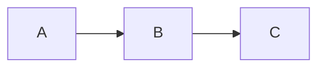

# Zensical

Generate documentation using Zensical - a modern static site generator from the creators of Material for MkDocs. Uses TOML configuration.

## Workflow

1. **New project?** Initialize with starter template from `assets/`
2. **Adding pages?** Use syntax from `references/syntax.md`
3. **Configuring?** Use patterns from `references/config.md`

## Initialize New Project

```bash
# Create project directory
mkdir my-docs && cd my-docs

# Set up virtual environment
python3 -m venv .venv
source .venv/bin/activate

# Install Zensical
pip install zensical
```

Copy starter files from this skill's `assets/` directory:
- `assets/zensical.toml` → project root
- `assets/docs/` → project docs folder

Run the dev server:
```bash
zensical serve
```

Build for production:
```bash
zensical build
```

## Configuration

Zensical uses `zensical.toml`:

```toml
[project]
site_name = "My Docs"
site_url = "https://example.com/"

[project.theme]
variant = "modern"

[project.theme.palette]
scheme = "default"
primary = "indigo"

[project.theme.features]
features = [
    "content.code.copy",
    "content.tabs.link",
    "navigation.instant",
]
```

Navigation is auto-generated from the `docs/` folder structure.

For full configuration options, see `references/config.md`.

## Creating Pages

Add markdown files to the `docs/` directory. Zensical auto-generates navigation from the folder structure.

### Quick Syntax Reference

**Admonitions:**
```markdown
!!! note "Title"
    Content here.

!!! warning
    Warning content.

??? tip "Collapsible"
    Hidden until clicked.
```

**Code blocks with features:**
````markdown
```python title="app.py" linenums="1" hl_lines="2"
def main():
    print("highlighted")  # (1)!
```

1. Code annotation text
````

**Content tabs:**
```markdown
=== "Python"
    ```python
    print("hello")
    ```

=== "JavaScript"
    ```javascript
    console.log("hello");
    ```
```

**Mermaid diagrams:**
````markdown

````

For complete syntax reference, see `references/syntax.md`.

## Resources

- **references/syntax.md** - Complete markdown syntax (admonitions, tabs, code blocks, diagrams, etc.)
- **references/config.md** - Full zensical.toml configuration reference
- **assets/zensical.toml** - Starter config template
- **assets/docs/** - Starter documentation pages
