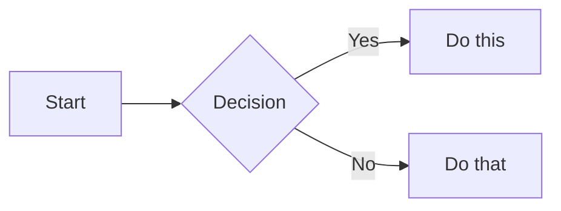

# Zensical Markdown Syntax Reference

## Admonitions

```markdown
!!! note "Optional Title"
    Content inside the admonition.

!!! warning
    Warning without custom title.

??? tip "Collapsible (closed by default)"
    Click to expand.

???+ info "Collapsible (open by default)"
    Already expanded.
```

**Types:** `note`, `abstract`, `info`, `tip`, `success`, `question`, `warning`, `failure`, `danger`, `bug`, `example`, `quote`

## Code Blocks

````markdown
```python title="example.py" linenums="1" hl_lines="2 3"
def hello():
    print("Hello")  # (1)!
    return True
```

1. This is an annotation
````

**Options:**
- `title="filename.py"` - Add title
- `linenums="1"` - Show line numbers (start at 1)
- `hl_lines="2 3"` - Highlight specific lines
- `# (1)!` - Code annotation marker

## Content Tabs

```markdown
=== "Python"
    ```python
    print("Hello")
    ```

=== "JavaScript"
    ```javascript
    console.log("Hello");
    ```
```

## Annotations

```markdown
This has an annotation. (1)
{ .annotate }

1. Annotation content here.
```

## Tables

```markdown
| Column 1 | Column 2 | Column 3 |
|----------|:--------:|---------:|
| Left     | Center   | Right    |
```

## Definition Lists

```markdown
Term
:   Definition of the term.

Another Term
:   Its definition.
```

## Task Lists

```markdown
- [x] Completed task
- [ ] Incomplete task
```

## Formatting

```markdown
==highlighted text==
^^superscript^^
~~subscript~~
~~strikethrough~~
**bold** and *italic*
`inline code`
```

## Mermaid Diagrams

````markdown

````

## Math (LaTeX)

```markdown
Inline: $E = mc^2$

Block:
$$
\frac{n!}{k!(n-k)!} = \binom{n}{k}
$$
```

## Icons and Emojis

```markdown
:material-account: :fontawesome-brands-github: :octicons-heart-16:
:smile: :rocket: :thumbsup:
```

## Buttons

```markdown
[Primary Button](#){ .md-button .md-button--primary }
[Secondary Button](#){ .md-button }
```

## Grids

```markdown
<div class="grid cards" markdown>

- :material-clock-fast: **Fast**

    Build docs quickly

- :material-scale-balance: **Flexible**

    Customize everything

</div>
```

## Footnotes

```markdown
Here is a footnote reference.[^1]

[^1]: This is the footnote content.
```

## Abbreviations

```markdown
The HTML specification is maintained by the W3C.

*[HTML]: Hyper Text Markup Language
*[W3C]: World Wide Web Consortium
```

## Details (Collapsible)

```markdown
<details>
<summary>Click to expand</summary>

Hidden content here.

</details>
```

## Keyboard Keys

```markdown
++ctrl+alt+del++
++cmd+shift+p++
```
